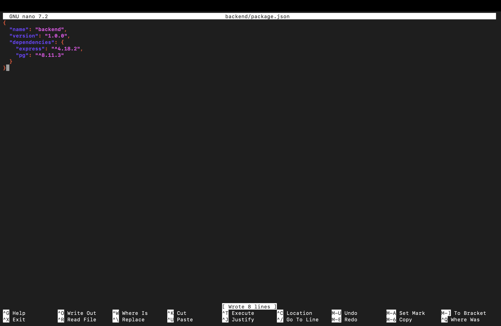
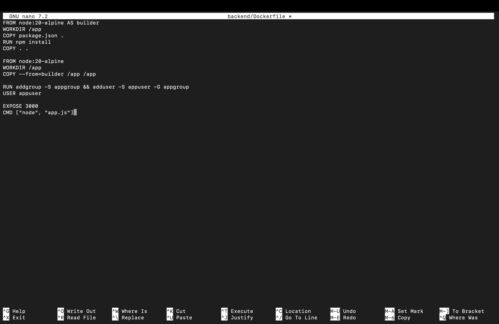
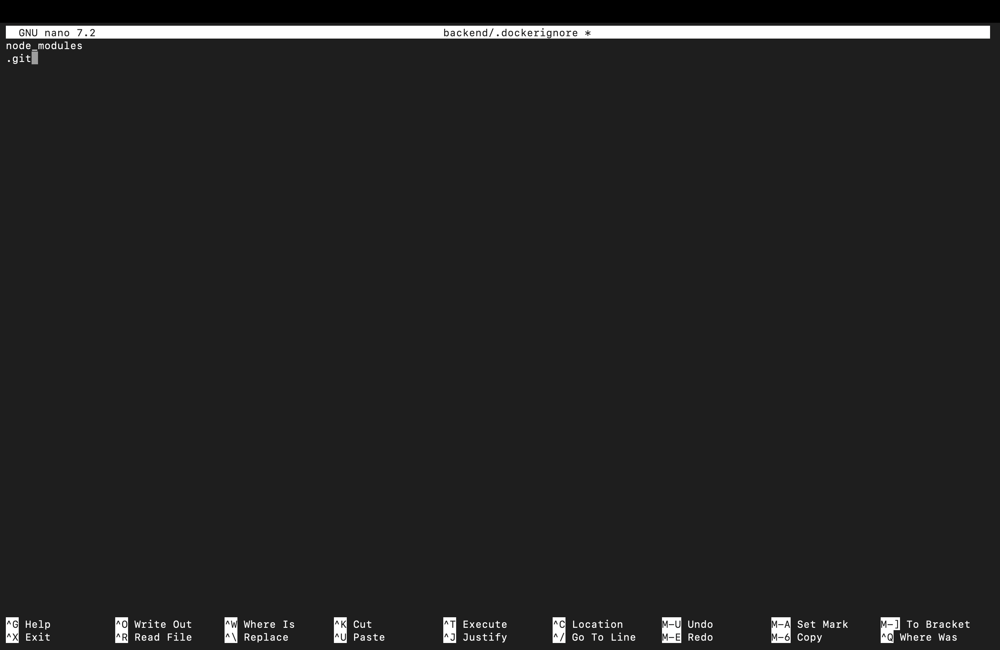

# 🚀 Containerized Web Application with SQL  
### Docker + Macvlan Networking


---

## 👤 Student Details

- **Name:** Om Mishra  
- **SAP ID:** 500119609  
- **Batch:** 4 CCVT  
- **College:** UPES Dehradun  

---

## 📌 Project Overview

This project demonstrates a containerized web application using:

- Node.js + Express (Backend API)  
- PostgreSQL (Database)  
- Docker & Docker Compose  
- Macvlan networking with static IPs  

---

## 🏗️ Architecture

```
Client (Postman / Curl)
        ↓
Backend Container (192.168.64.10)
        ↓
PostgreSQL Container (192.168.64.11)
```

---

## 🛠️ Technologies Used

- Docker  
- Docker Compose  
- Node.js  
- PostgreSQL  
- Macvlan Networking  
- Ubuntu (UTM VM)  

---

## ✨ Features

- REST API (GET, POST, Health Check)  
- Database integration  
- Auto table creation  
- Multi-stage Docker build  
- Non-root user  
- Persistent storage (volume)  
- Static IP networking  

---

## 🚀 Run Project

```bash
docker compose up -d --build
```

---

## ⚙️ Step-by-Step Setup

### 1. Install Docker

```bash
sudo apt update
sudo apt install -y docker.io docker-compose
sudo systemctl start docker
sudo systemctl enable docker
sudo usermod -aG docker $USER
```

---

### 2. Create Project Structure

```bash
mkdir containerized-webapp
cd containerized-webapp
mkdir backend database screenshots
```

---

### 3. Backend Setup

```bash
nano backend/app.js
nano backend/package.json
nano backend/Dockerfile
nano backend/.dockerignore
```

---

### 4. Database Setup

```bash
nano database/init.sql
nano database/Dockerfile
nano database/.dockerignore
```

---

### 5. Check Network Interface

```bash
ip a
```

---

### 6. Create Macvlan Network

```bash
docker network create -d macvlan \
--subnet=192.168.64.0/24 \
--gateway=192.168.64.1 \
-o parent=enp0s1 \
mynet
```

---

### 7. Configure Docker Compose

```bash
nano docker-compose.yml
```

---

### 8. Build & Run

```bash
docker compose build
docker compose up -d
```

---

### 9. Fix Macvlan Host Isolation

```bash
sudo ip link add macvlan-shim link enp0s1 type macvlan mode bridge
sudo ip addr add 192.168.64.50/24 dev macvlan-shim
sudo ip link set macvlan-shim up
```

---

## 🧪 API Testing

### Health Check

```bash
curl http://192.168.64.10:3000/health
```

---

### Insert Data

```bash
curl -X POST http://192.168.64.10:3000/users \
-H "Content-Type: application/json" \
-d '{"name":"Omi"}'
```

---

### Fetch Data

```bash
curl http://192.168.64.10:3000/users
```

---

## 💾 Persistence Test

```bash
docker compose down
docker compose up -d
```

---

## 🌐 Container Networking

| Container | IP |
|----------|----|
| Backend | 192.168.64.10 |
| Database | 192.168.64.11 |

---

## 📸 Screenshots

  
  
  

---

## 🎯 Conclusion

This project demonstrates containerization, networking using macvlan, and persistent storage using Docker.
